# pre-post

Visual diff tool that captures before/after screenshots for PRs. Use it as a Claude Code skill for automatic visual documentation, or run it directly from the CLI.

> Forked from [before-and-after](https://github.com/vercel-labs/before-and-after) by [James Clements](https://github.com/jamesclement) / Vercel Labs.

## TODO

- [ ] Publish to npm so `npm i -g pre-post` and `npx pre-post` work out of the box

## What Changed from the Original

| Area | before-and-after | pre-post |
|------|-----------------|----------|
| Browser engine | `agent-browser` (Vercel-proprietary) | **Playwright** (direct dependency) |
| Screenshot quality | 1x | **2x retina** (`deviceScaleFactor: 2`) |
| Route detection | Manual | **Automatic** from `git diff` (Next.js App/Pages Router, Remix, SvelteKit) |
| Responsive capture | Single viewport | **Desktop + mobile** per route (`--responsive`) |
| CLI subcommands | URL pairs only | `detect`, `compare`, `run` subcommands |
| Skill orchestration | Basic capture | Full workflow: route detection, Claude refinement, user approval, PR posting |
| Font/animation handling | None | Waits for `document.fonts.ready`, disables CSS animations |

## How It Works

```mermaid
flowchart TD
    A[pre-post] --> B{Mode?}

    B -->|Manual| C["pre-post url1 url2"]
    B -->|Automatic| D["pre-post run"]
    B -->|Claude Code Skill| E["/pre-post"]

    D --> F["git diff --name-only"]
    F --> G{Detect framework}
    G -->|Next.js App Router| H[Map files → routes]
    G -->|Next.js Pages Router| H
    G -->|Remix / SvelteKit| H
    G -->|Unknown| I["Default to /"]
    H --> J[Route list with confidence]

    E --> F
    E --> K[Claude refines routes]
    K --> J

    C --> L[Playwright]
    J --> L

    L --> M{System Chrome?}
    M -->|Found| N[Use system Chrome]
    M -->|Not found| O[Use bundled Chromium]
    N --> P[Capture screenshots]
    O --> P

    P --> Q[Disable animations]
    Q --> R[Wait for fonts]
    R --> S[Take 2x retina screenshot]

    S --> T{Output}
    T -->|Default| U["Save to ~/Downloads"]
    T -->|--markdown| V[Upload to 0x0.st]
    V --> W[Markdown table for PR]

    style A fill:#4f46e5,color:#fff
    style L fill:#2563eb,color:#fff
    style S fill:#059669,color:#fff
```



## Prerequisites

- **Node.js** 18+
- **Chromium** (auto-installed on first run via Playwright)

```bash
# Install Chromium browser for Playwright (one-time setup)
npx playwright install chromium
```

## Install

```bash
npm i -g pre-post
```

## Basic Use

### As a Claude Code Skill (recommended)

After making visual UI changes, say `/pre-post` or "take before and after screenshots". Claude will:

1. Detect affected routes from your git diff
2. Propose routes for your approval
3. Capture desktop + mobile screenshots (production vs localhost)
4. Show you the screenshots for approval
5. Upload and append markdown to your PR

### From the CLI

Capture any two URLs:

```bash
pre-post site.com localhost:3000
```

Use existing images:

```bash
pre-post before.png after.png
```

## CLI Subcommands

### `detect` -- Route Detection

Detect affected routes from git changes:

```bash
pre-post detect                        # Auto-detect framework
pre-post detect --framework nextjs     # Force framework
```

Outputs JSON with route paths, confidence levels, and source files.

### `compare` -- URL Comparison

Compare before/after states across routes:

```bash
pre-post compare --before-base https://prod.com --after-base http://localhost:3000
pre-post compare --before-base URL --after-base URL --routes /dashboard,/settings
pre-post compare --before-base URL --after-base URL --responsive  # Desktop + mobile
```

### `run` -- Full Auto

Combines `detect` + `compare`:

```bash
pre-post run --before-base https://prod.com --after-base http://localhost:3000
```

## Options

Capture a specific element using a CSS selector:

```bash
pre-post url1 url2 ".hero"
```

Use different selectors for before and after:

```bash
pre-post url1 url2 ".old" ".new"
```

Capture at mobile (375x812), tablet (768x1024), or custom viewport:

```bash
pre-post url1 url2 --mobile
pre-post url1 url2 --size 1920x1080
```

Capture the entire scrollable page:

```bash
pre-post url1 url2 --full
```

Output a markdown table for PR descriptions:

```bash
pre-post url1 url2 --markdown
```

Save to a custom location:

```bash
pre-post url1 url2 --output ./screenshots
```

Upload to a custom image storage service:

```bash
pre-post url1 url2 --upload my-s3-uploader
```

By default, images are uploaded to [0x0.st](https://0x0.st). For heavy usage or sensitive captures, use your own upload handler.

## Route Detection

Pre-post automatically maps `git diff --name-only` to affected UI routes:

| Changed File | Detected Route | Confidence |
|---|---|---|
| `app/page.tsx` | `/` | high |
| `app/dashboard/page.tsx` | `/dashboard` | high |
| `app/(marketing)/about/page.tsx` | `/about` (strips route groups) | high |
| `app/blog/[slug]/page.tsx` | `/blog/[slug]` | high |
| `app/dashboard/layout.tsx` | `/dashboard` | medium |
| `app/dashboard/components/Chart.tsx` | `/dashboard` | medium |
| `globals.css`, `tailwind.config.ts` | `/` | low |
| `app/api/*`, `middleware.ts` | Skipped (no visual) | -- |

Supports:
- **Next.js App Router** (route groups, dynamic segments, parallel routes, catch-all)
- **Next.js Pages Router** (`pages/`, `_app.tsx`, `_document.tsx`)
- **Remix** (`routes/` directory)
- **SvelteKit** (`src/routes/+page.svelte`)
- **Generic fallback** (defaults to `/`)

## Add Skill

Install as a Claude Code skill:

```bash
npx skills add juangadm/pre-post
```

The skill uses `gh` to detect the associated PR and Playwright for screenshots.

## Credits

- Original [before-and-after](https://github.com/vercel-labs/before-and-after) by [James Clements](https://github.com/jamesclement) at [Vercel Labs](https://github.com/vercel-labs)
- Browser automation powered by [Playwright](https://playwright.dev/)

## License

MIT
